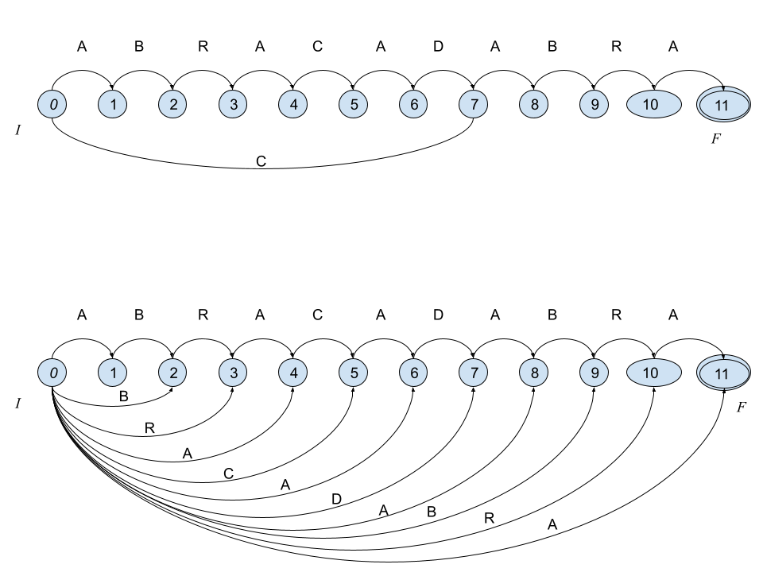
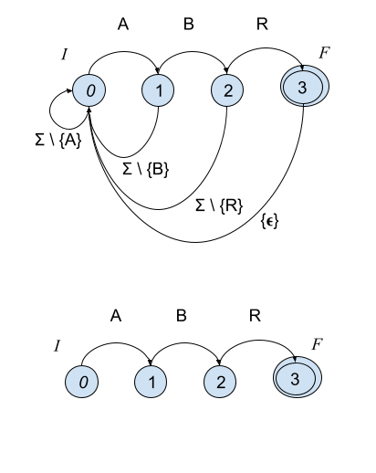

---
title: Búsqueda en cadenas de texto
lang: es-MX
author: Eric S. Téllez

...


## Objetivo
Se introducirá implementarán y compararán algoritmos de búsqueda de patrones en cadenas de símbolos.

## Introducción

La presente unidad esta dedicada a los algoritmos de búsqueda de patrones en cadenas de símbolos. Antes de comenzar vamos a definir el problema:

Dado un alfabeto de simbolos $\Sigma = \{a_1, a_2, \cdots, a_\sigma \}$ una cadena de tamaño $T[1,n]$ esta definida como la concatenación de $n$ símbolos, i.e., $T \in \Sigma^n$. Esto es, si el alfabeto es binario, $\Sigma = \{0, 1\}$, para $n=3$, $T$ podría ser cualquiera de las siguientes cadenas de bits: 
$\{ 000, 001, 010, 011, 100, 101, 110, 111 \}$.


Por ejemplo, la cadena $T=\texttt{ABRACADABRA}$ esta descrita por el alfabeto $\Sigma = \{A,B,C,D,R\}$, y podemos acceder a cada uno de los simbolos mediante un subíndice, e.g., $T_1=\texttt{A}, T_2=\texttt{B}, T_3=\texttt{R}$, etc. También se puede acceder a subcadenas haciendo uso de la notación $T_{i:j}$, la cual obtendría una subcadena de tamaño $j-i+1$ (concatenando los simbolos de que van de $i$ a $j$ en $T$). Si $j < i$ entonces se accede a la cadena vacia $\epsilon$.

Es posible concatenar cadenas para obtener nuevas cadenas, por ejemplo, $A[1,11]=\texttt{ABRACADABRA}$ y $B[1,11] = \texttt{ARBADACARBA}$, ambas vienen del mismo alfabeto, y pueden ser concatenadas $C[1,22] = A B = \texttt{ABRACADABRAARBADACARBA}$. De la misma forma es posible crearlas a partir de concatener cadenas y símbolos. 

Ahora, hay tres tipos de subcadenas, según su aparición dentro de otra cadena. Sean $A, B, C$ tres cadenas de símbolos; $D = ABC$ sería la concatenación de las tres cadenas, entonces a $A$ se le llama _prefijo_ de $D$, $C$ es llamado _sufijo_ de $D$ y $B$ sería un _factor_ de $D$.

### El problema de búsqueda en cadenas
Dada una cadena larga $T[1,n]$ y una cadena corta $P[1,m]$, llamada _patrón_, el problema consiste en encontrar todas las ocurrencias de $P$ en $T$, esto es, todos los puntos donde $P$ sea una subcadena en $T$. Esta operación es llamada _búsqueda_. Para esto se pueden tener dos variantes típicas:

1. $T$ es estático o cambia muy poco, por lo que se puede crear una estructura sobre $T$ para resolver las búsquedas.
2. $T$ varia frecuentemente, o no esta acotado, por lo que la estrategía es apoyarse en una estructura sobre $P$ para resolver consultas de manera eficiente.


### Esquemas de búsqueda
Para el primer problema, se puede crear algún índice tipo índice invertido si el texto ser divido en pequeñas piezas o tokens, e.g., palabras y símbolos de puntuación en texto escrito en lenguaje natural (y con pocas propiedades aglutinantes). De otra forma requerirá índices similares a árboles de sufijos o arreglos de sufijos. Estas últimas estructuras se basan en crear un árbol que contenga todos los sufijos (mediante punteros e índices al texto original).
(Ver video)

Para el segundo problema, la idea general es revisar la cadena $T$ en ventanas de tamaño $m$ y calcular una estructura sobre $P$ tal que usando la información de la ventana siendo analizada sea posible avanzar la ventana de manera segura (sin perder información) y rápida (moverla lo más posible). Para esto se usan los prefijos, sufijos y factores de $P$ y la ventana en cuestión. Esta unidad se enfoca en este segundo problema.

### Autómatas finitos y búsqueda de cadenas

Muchos de los algoritmos de búsqueda de patrones en cadenas estan basados en algoritmos sobre autómatas finitos, por lo que nos remitiremos a dicha estructura, el _autómata finito_. 

#### Autómatas Finitos
Para nuestros propósitos, un autómata finito es una estructura discreta formada por una serie de estados $Q$, entre los cuales hay dos tipos de estados especiales. El estado inicial $I \in Q$ y los estados terminales $F \subseteq Q$.
Entre cada par de estados puede existir una transición, etiquetada por elementos de un alfabeto $\Sigma \cup \{\epsilon\}$; estas transiciones son descritas de manera precisa mediante una función especial llamada función de transición $\mathcal{D}(q, \alpha) = \{q_1, \cdots, q_k\}$ esto es, asocia estados $Q$ por medio de símbolos $\alpha \in \Sigma \cup \{\epsilon\}$. Un autómata es descrito por estas partes como $A = (Q, \Sigma, I, F, \mathcal{D})$.

Dependiendo de la función de transición, podemos distinguir dos tipos de autómatas. El autómata determinista (DFA) es aquel donde $\mathcal{D}$ asocia pares de estados; y $\mathcal{D}$ puede definirse en terminos de una función parcial $\delta : Q \times \Sigma \rightarrow Q$. El no determinista (NFA) puede asociar diferentes estados usando el mismo cáracter de transición, $\mathcal{D}: Q \times \Sigma \rightarrow  \{q_1,\cdots,q_k\}$ para $k>1$, así como también cuando hay alguna transición definida por la cadena vacia, i.e., $\mathcal{D}(q, \epsilon)$. El NFA suele ser mucho más sucinto en cuanto a su descripción formal, lo que hace preferible para trabajar en la práctica; sin embargo, es necesario hacer notar que NFA y DFA son equivalentes en cuanto a su capacidad de expresión de cadenas.

Las siguientes figuras muestran un par de autómatas finitos. El primero es un DFA que es capaz de reconocer las palabras `ABRACADABRA` y `CABRA`. El segundo autómata es no determininista (NFA) y reconoce `ABRACADABRA` y todos sus sufijos, i.e., `BRACADABRA`, `RACADABRA`, `ACADABRA`, `CADABRA`, `ADABRA`, `DABRA`, `ABRA`, `BRA`, `RA`, y `A`.




### Algoritmos

Muchos de los algoritmos que trabajan sobre textos que varian mucho, no estan acotados, o simplemente son demasiado grandes para poder ser preprocesado, utilizan alguna estructura basada en un autómata finito para acelerar la resolución de búsquedas.

Como ya se había comentado, dichos algoritmos intentarán revisar el texto $T[1,n]$ usando ventanas $w$ del tamaño del patrón $P[1,m]$. Dichas ventanas deberan ser probadas en la estructura con el fin de observar si es posible o no un emparejamiento con $P$. El objetivo de la estructura y el algoritmo será avanzar tan adelante como sea posible la ventana sin perder posibles ocurrencias.

Considere el siguiente ejemplo:
```
    1  2  3  4  5  6  7  8  9  10 11
T = A  B  R  A  C  A  D  A  B  R  A
    _______
       _______  w
          _______


P = A B R

```


Se creará un autómata $(\{0, 1, 2, 3\}, \{A, B, C, D, R\}, 0, \{3\}, \mathcal{D})$. A continuación se ven dos posibles autómatas que pueden usarse para resolver las búsquedas:



La diferencia viene en la definición de $\mathcal{D}$. El primero puede consumir cáracter por cáracter de $T$ y reportar una ocurrencia cada vez que se toque el estado $F$ (reportar la posición en $T$ dónde ocurre). El segundo hace uso del concepto de ventana, para cada ventana solo existirá un emparejamiento si iniciando en $0$ se termina en el estado $3$. En parte, los algoritmos verán como avanzar la ventana de manera más eficaz; es posible leer las prefijos o sufijos de las ventanas, así mismo, es posible utilizar información de factores para mejorar el deslizamiento de la ventana. Para más información referirse a [NR02].

Con la representación basada en autómatas es posible consider clases de caracteres, e.g., dígitos numéricos, caracteres alfabeticos, puntuaciones, o en general conjuntos de símbolos que se deseen agrupar. Así como soportar cualquier tipo de expresión regular [NR02].


### El algoritmo _Shift-And_
Una de los algoritmos más sencillos y eficientes es el algoritmos de Shift-And, el cual consiste en simular el NFA usando operaciones a nivel de bits. En particular, este algoritmo es muy veloz en patrones que quepan en la palabra de la computadora donde se aplica (e.g., 32 o 64 bits); cuando el patrón sea más largo que el tamaño de la palabra, las operaciones pueden ser implementadas teniendo en cuenta los corrimientos a nivel de bits que pudieran surgir en las operaciones.


## Referencias
- [NR02] Navarro, G., & Raffinot, M. (2002). Flexible pattern matching in strings: practical on-line search algorithms for texts and biological sequences. Cambridge university press.
- [NR00] Navarro, G., & Raffinot, M. (2000). Fast and flexible string matching by combining bit-parallelism and suffix automata. Journal of Experimental Algorithmics (JEA), 5, 4-es.


## Actividades
Implementación y comparación de diferentes algoritmos de intersección de conjuntos.

Lea cuidadosamente las instrucciones y desarrolle las actividades. Entregue el reporte correspondiente en tiempo.


### Actividad 0 [Sin entrega]

1. Lea y comprenda los artículos relacionados (listados en la introducción).

### Actividad 1 [Con reporte]
1. Cargue el archivo `listas-posteo-100.json` del tema 3. Si lo desea, puede usar listas de posteo generadas con otros conjuntos de datos, usando los scripts de las unidades pasadas. Si es necesario, repase los temas anteriores para recordar la naturaleza y propiedades de las listas.

 - Sea $P^{(2)}$ el conjunto de todos los posibles pares de listas entre las 100 listas de posteo. Seleccione de manera aleatoria $A \subset P^{(2)}$, $|A| = 1000$.
 - Sea $P^{(3)}$ el conjunto de todas las posibles combinaciones de tres listas de posteo entre las 100 listas disponibles, Seleccione de manera aleatoria $B \subset P^{(3)}$, $|B| = 1000$.
 - Sea $P^{(4)}$ el conjunto de todas las posibles combinaciones de cuatro listas de posteo entre las 100 listas disponibles. Seleccione de manera aleatoria $C \subset P^{(4)}$, $|C| = 1000$.

2. Implemente los algoritmos de las secciones 3.1 _Melding Algorithms_ y 3.2 _Search algorithms_ (en especial 3.2.1 y 3.2.2) de [@BLOLS2010].

3. Realice y reporte los siguientes experimentos:
 - Intersecte cada par de listas $a, b \in A$, y reporte de manera acumulada el tiempo en segundos y el número de comparaciones. 
 - Intersecte cada tripleta de listas $a, b, c \in B$, y reporte de manera acumulada el tiempo en segundos y el número de comparaciones. 
 - Intersecte cada tetrapleta de listas $a, b, c, d \in C$, y reporte de manera acumulada el tiempo en segundos y el número de comparaciones.
 - Cree una figura `boxplot` que describa el tiempo en segundos para los tres experimentos.
 - Cree una figura `boxplot` que describa el número de comparaciones para los tres experimentos.
 - Cree una figura `boxplot` que describa las longitudes de las intersecciones resultantes para $A$, $B$, $C$.

### Entregable:
El reporte deberá ser en formato notebook y el PDF del mismo notebook. El notebook debe contener las
implementaciones. Recuerde que el reporte debe llevar claramente su nombre, debe incluir una
introducción, la explicación de los métodos usados, la explicación de los experimentos realizados, la discusión de los resultados, y finalizar con sus observaciones y conclusiones.

_Nota sobre la generación del PDF_: Jupyter no genera el PDF directamente, a menos que se tengan instalados una gran cantidad de paquetes, entre ellos una instalación completa de LaTeX. En su lugar, para generar el PDF en Jupyter primero guarde el notebook como HTML y luego genere el PDF renderizando e imprimiendo el HTML con su navegador. En lugar de imprimir, seleccione guardar como PDF.
