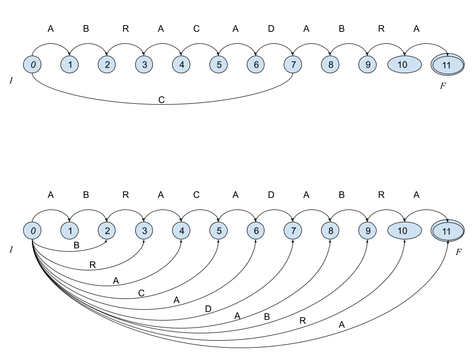
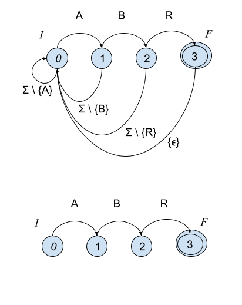
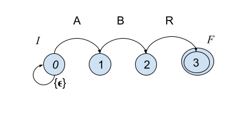

# Búsqueda en cadenas de texto {#sec-cadenas}

## Objetivo {.unnumbered}
Introducir y comparar algoritmos de búsqueda de patrones en cadenas de símbolos.


## Introducción

La presente unidad está dedicada a los algoritmos de búsqueda de patrones en cadenas de símbolos. Antes de comenzar vamos a definir el problema:

Dado un alfabeto de símbolos $\Sigma = \{a_1, a_2, \cdots, a_\sigma \}$, una cadena de tamaño $T[1,n]$ está definida como la concatenación de $n$ símbolos, i.e., $T \in \Sigma^n$. Esto es, si el alfabeto es binario, $\Sigma = \{0, 1\}$, para $n=3$, $T$ podría ser cualquiera de las siguientes cadenas de bits: 
$\{ 000, 001, 010, 011, 100, 101, 110, 111 \}$.


Por ejemplo, la cadena $T=\texttt{ABRACADABRA}$ está descrita por el alfabeto $\Sigma = \{A,B,C,D,R\}$, y podemos acceder a cada uno de los símbolos mediante un subíndice, e.g., $T_1=\texttt{A}, T_2=\texttt{B}, T_3=\texttt{R}$, etc. También se puede acceder a subcadenas haciendo uso de la notación $T_{i:j}$, la cual obtendría una subcadena de tamaño $j-i+1$ (concatenando los símbolos que van de $i$ a $j$ en $T$). Si $j < i$ entonces se accede a la cadena vacía $\epsilon$.

Es posible concatenar cadenas para obtener nuevas cadenas, por ejemplo, $A[1,11]=\texttt{ABRACADABRA}$ y $B[1,11] = \texttt{ARBADACARBA}$, ambas vienen del mismo alfabeto, y pueden ser concatenadas $C[1,22] = A B = \texttt{ABRACADABRAARBADACARBA}$. De la misma forma es posible crearlas a partir de concatenar cadenas y símbolos. 

Ahora, hay tres tipos de subcadenas, según su aparición dentro de otra cadena. Sean $A, B, C$ tres cadenas de símbolos; $D = ABC$ sería la concatenación de las tres cadenas, entonces a $A$ se le llama _prefijo_ de $D$, $C$ es llamado _sufijo_ de $D$ y $B$ sería un _factor_ de $D$.

### El problema de búsqueda en cadenas
Dada una cadena larga $T[1,n]$ y una cadena corta $P[1,m]$, llamada _patrón_, el problema consiste en encontrar todas las ocurrencias de $P$ en $T$, esto es, todos los puntos donde $P$ sea una subcadena en $T$. Esta operación es llamada _búsqueda_. Para esto se pueden tener dos variantes típicas:

1. $T$ es estático o cambia muy poco, por lo que se puede crear una estructura sobre $T$ para resolver las búsquedas.
2. $T$ varía frecuentemente, o no está acotado, por lo que la estrategia es apoyarse en una estructura sobre $P$ para resolver consultas de manera eficiente.


### Esquemas de búsqueda
Para el primer problema, se puede crear algún índice de tipo índice invertido si el texto puede ser dividido en pequeñas piezas o tokens, e.g., palabras y símbolos de puntuación en texto escrito en lenguaje natural (y con pocas propiedades aglutinantes). De otra forma requerirá índices similares a árboles de sufijos o arreglos de sufijos. Estas últimas estructuras se basan en crear un árbol que contenga todos los sufijos (mediante punteros e índices al texto original).
(Ver video)

Para el segundo problema, la idea general es revisar la cadena $T$ en ventanas de tamaño $m$ y calcular una estructura sobre $P$ tal que usando la información de la ventana siendo analizada sea posible avanzar la ventana de manera segura (sin perder información) y rápida (moverla lo más posible). Para esto se usan los prefijos, sufijos y factores de $P$ y la ventana en cuestión. Esta unidad se enfoca en este segundo problema.

### Autómatas finitos y búsqueda de cadenas

Muchos de los algoritmos de búsqueda de patrones en cadenas están basados en algoritmos sobre autómatas finitos, por lo que nos remitiremos a dicha estructura, el _autómata finito_. 

#### Autómatas Finitos
Para nuestros propósitos, un autómata finito es una estructura discreta formada por una serie de estados $Q$, entre los cuales hay dos tipos de estados especiales. El estado inicial $I \in Q$ y los estados terminales $F \subseteq Q$.
Entre cada par de estados puede existir una transición, etiquetada por elementos de un alfabeto $\Sigma \cup \{\epsilon\}$; estas transiciones son descritas de manera precisa mediante una función especial llamada función de transición $\mathcal{D}(q, \alpha) = \{q_1, \cdots, q_k\}$ esto es, asocia estados $Q$ por medio de símbolos $\alpha \in \Sigma \cup \{\epsilon\}$. Un autómata es descrito por estas partes como $A = (Q, \Sigma, I, F, \mathcal{D})$.

Dependiendo de la función de transición, podemos distinguir dos tipos de autómatas. El autómata determinista (DFA) es aquel donde $\mathcal{D}$ asocia pares de estados; y $\mathcal{D}$ puede definirse en términos de una función parcial $\delta : Q \times \Sigma \rightarrow Q$. El no determinista (NFA) puede asociar diferentes estados usando el mismo carácter de transición, $\mathcal{D}: Q \times \Sigma \rightarrow  \{q_1,\cdots,q_k\}$ para $k>1$, así como también cuando hay alguna transición definida por la cadena vacía, i.e., $\mathcal{D}(q, \epsilon)$. El NFA suele ser mucho más sucinto en cuanto a su descripción formal, lo que lo hace preferible para trabajar en la práctica; sin embargo, es necesario hacer notar que NFA y DFA son equivalentes en cuanto a su capacidad de expresión de cadenas.

Las siguientes figuras muestran un par de autómatas finitos. El primero es un DFA que es capaz de reconocer las palabras `ABRACADABRA` y `CABRA`. El segundo autómata es no determinista (NFA) y reconoce `ABRACADABRA` y todos sus sufijos, i.e., `BRACADABRA`, `RACADABRA`, `ACADABRA`, `CADABRA`, `ADABRA`, `DABRA`, `ABRA`, `BRA`, `RA`, y `A`.




### Algoritmos

Muchos de los algoritmos que trabajan sobre textos que varían mucho, no están acotados, o simplemente son demasiado grandes para poder ser preprocesados, utilizan alguna estructura basada en un autómata finito para acelerar la resolución de búsquedas.

Como ya se había comentado, dichos algoritmos intentarán revisar el texto $T[1,n]$ usando ventanas $w$ del tamaño del patrón $P[1,m]$. Dichas ventanas deberán ser probadas en la estructura con el fin de observar si es posible o no un emparejamiento con $P$. El objetivo de la estructura y el algoritmo será avanzar tan adelante como sea posible la ventana sin perder posibles ocurrencias.

Considere el siguiente ejemplo:
```
    1  2  3  4  5  6  7  8  9  10 11
T = A  B  R  A  C  A  D  A  B  R  A
    _______
       _______  w
          _______
             _______

P = A B R
```

Se creará un autómata $(\{0, 1, 2, 3\}, \{A, B, C, D, R\}, 0, \{3\}, \mathcal{D})$. A continuación se ven dos posibles autómatas que pueden usarse para resolver las búsquedas:



La diferencia radica en la definición de $\mathcal{D}$. El primero puede consumir carácter por carácter de $T$ y reportar una ocurrencia cada vez que se toque el estado $F$ (reportar la posición en $T$ donde ocurre). El segundo hace uso del concepto de ventana; para cada ventana solo existirá un emparejamiento si iniciando en $0$ se termina en el estado $3$. En parte, los algoritmos verán cómo avanzar la ventana de manera más eficaz; es posible leer los prefijos o sufijos de las ventanas, así como utilizar información de factores para mejorar el deslizamiento de la ventana. Para más información, referirse a [@NR02].

Con la representación basada en autómatas es posible considerar clases de caracteres, e.g., dígitos numéricos, caracteres alfabéticos, puntuaciones, o en general conjuntos de símbolos que se deseen agrupar. Así como soportar cualquier tipo de expresión regular [@NR02].


### El algoritmo _Shift-And_
Uno de los algoritmos más sencillos y eficientes es el algoritmo Shift-And, el cual consiste en simular el NFA usando operaciones a nivel de bits. En particular, este algoritmo es muy veloz en patrones que quepan en la palabra de la computadora donde se aplica (e.g., 32 o 64 bits); cuando el patrón sea más largo que el tamaño de la palabra, las operaciones pueden ser implementadas teniendo en cuenta los corrimientos a nivel de bits que pudieran surgir en las operaciones.
Dado que las operaciones a nivel de bits se realizan de manera paralela, estas pueden realizarse de manera muy eficiente.

```
    1  2  3  4  5  6  7  8  9  10 11
T = A  B  R  A  C  A  D  A  B  R  A

P = A  B  R
```

Como se había observado, es suficiente tener 4 estados para este patrón.
Es necesario crear la tabla $D$ que codifica $\mathcal{D}$. Para construirla, es necesario codificar el alfabeto en una matriz binaria de $|\Sigma| \times m$ elementos (i.e., longitud del alfabeto $\times$ longitud del patrón). Donde cada fila corresponde a los caracteres del alfabeto $\Sigma$ y las columnas a los estados (que a su vez corresponden con el patrón $P$); cada fila en $D$ codifica con 1 si para cada estado, el carácter se encuentra en el patrón en la columna correspondiente, y 0 si no lo hace.
Adicionalmente, se debe considerar que el estado inicial tiene una transición a sí mismo con la cadena vacía $\epsilon$. Para nuestro ejemplo, la matriz quedaría como sigue:
```
    R  B  A        <- P reverso para su codificación
    3  2  1  0     <- estados
    F        I     <- estados de fin e inicio
A   0  0  1  0   \
B   0  1  0  0    |
C   0  0  0  0    |  codificación de la función
D   0  0  0  0    |  de transición D
R   1  0  0  0    |  
eps 0  0  0  1   /

```
El patrón y el contador están revertidos para denotar su posición en la codificación binaria. Note que se ha añadido una transición de cadena vacía en el estado $0$. 



Shift-And es un algoritmo bastante simple y eficiente, que recorre el texto por ventanas, haciendo uso del autómata del patrón.

A continuación se muestra una implementación en lenguaje Julia.
```julia
function pattern(pat::T) where T
    D = Dict{eltype(pat),UInt64}()
    for i in eachindex(pat)
        c = pat[i]
        d = get!(D, c, zero(UInt64))
        d |= 1 << (i-1)
        D[c] = d
    end
    D
end

function search(text, pat, L=Int[])
    D = pattern(pat)
    S = 0
    plen = length(pat)
    m = 1 << (plen - 1)
    for i in eachindex(text)
        d = get(D, text[i], 0)
        S = ((S << 1) | 1) & d
        if S & m > 0
            push!(L, i-plen+1)
        end
    end
    L
end
```

La función `pattern` construye de manera parcial la tabla $D$, mientras `search` implementa el algoritmo Shift-And. La operación más importante para entender el algoritmo está en la línea `S = ((S << 1) | 1) & d`; donde la transición por $\epsilon$ en el estado cero se realiza mediante la operación a nivel de bits `| 1`, se simulan las transiciones en el autómata mediante `S << 1` y `& d` hace el emparejamiento con el carácter que está siendo leído. Note también que `d` se pone a cero cuando el carácter no está en $D$ (i.e., está en $T$ pero no en $P$). Las ocurrencias se guardan en `L` y ocurren cuando `S` tiene un 1 en la última posición del patrón, i.e., el estado final $F$ está activo.

Al correr la función, tenemos lo siguiente
```julia
julia> search("ABRACADABRA", "ABR")
2-element Vector{Int64}:
 1
 8

julia> search("MISSISSIPPI", "SS")
2-element Vector{Int64}:
 3
 6

julia> search("MISSISSIPPI", "I")
4-element Vector{Int64}:
  2
  5
  8
 11
```

Por las características de Julia, podemos cambiar fácilmente el tipo de los datos y seguir obteniendo una buena eficiencia.
```julia
julia> A = rand(1:6, 1000_000_000)
julia> @time search(A, [3,1,4,1,6]);
31.544242 seconds (22 allocations: 2.001 MiB)
```


## Actividades

### Actividad 0 [Sin entrega]

1. Lea y comprenda los artículos relacionados (listados en la introducción).

### Actividad 1 [Con reporte]
1. Sea $T$ el contenido del archivo `pi-1m.txt`, éste contiene el primer millón de dígitos de $\pi$ (tomado de https://newton.ex.ac.uk/research/qsystems/collabs/pi/). También puede usar los archivos de datos que hemos usado pero debería adaptar y explicar la adaptación en el reporte.

 - Considere que $\Sigma = \{0, 1, 2, 3, 4, 5, 6, 7, 8, 9\}$
 - Sea $A \subseteq \Sigma^4$, $|A| = 1000$; seleccione de manera aleatoria $A$.
 - Sea $B \subseteq \Sigma^8$, $|B| = 1000$; seleccione de manera aleatoria $B$.
 - Sea $C \subseteq \Sigma^{16}$, $|C| = 1000$; seleccione de manera aleatoria $C$.
 - Sea $D \subseteq \Sigma^{32}$, $|D| = 1000$; seleccione de manera aleatoria $D$.
 - Sea $E \subseteq \Sigma^{64}$, $|E| = 1000$; seleccione de manera aleatoria $E$.

2. Implemente el algoritmo Shift-And o use el que se proporciona antes.
3. Implemente el algoritmo naïve que consiste en verificar ventana a ventana por emparejamiento sin usar operaciones a nivel de bits y avanzando de uno en uno los caracteres.

4. Realice y reporte los siguientes experimentos:
 - Para cada $p \in A$ busque $p$ en $T$ y reporte de manera acumulada el tiempo en segundos, compare Shift-And y el algoritmo naïve usando figuras `boxplot`.
 - Para cada $p \in B$ busque $p$ en $T$ y reporte de manera acumulada el tiempo en segundos, compare Shift-And y el algoritmo naïve usando figuras `boxplot`.
 - Para cada $p \in C$ busque $p$ en $T$ y reporte de manera acumulada el tiempo en segundos, compare Shift-And y el algoritmo naïve usando figuras `boxplot`.
 - Para cada $p \in D$ busque $p$ en $T$ y reporte de manera acumulada el tiempo en segundos, compare Shift-And y el algoritmo naïve usando figuras `boxplot`.
 - Para cada $p \in E$ busque $p$ en $T$ y reporte de manera acumulada el tiempo en segundos, compare Shift-And y el algoritmo naïve usando figuras `boxplot`.


### Entregable
El reporte deberá ser en formato notebook y el PDF del mismo notebook. El notebook debe contener las
implementaciones. Recuerde que el reporte debe llevar claramente su nombre, debe incluir una
introducción, la explicación de los métodos usados, la explicación de los experimentos realizados, la discusión de los resultados, y finalizar con sus observaciones y conclusiones.

_Nota sobre la generación del PDF_: Jupyter no genera el PDF directamente, a menos que se tengan instalados una gran cantidad de paquetes, entre ellos una instalación completa de LaTeX. En su lugar, para generar el PDF en Jupyter primero guarde el notebook como HTML y luego genere el PDF renderizando e imprimiendo el HTML con su navegador. En lugar de imprimir, seleccione guardar como PDF.
